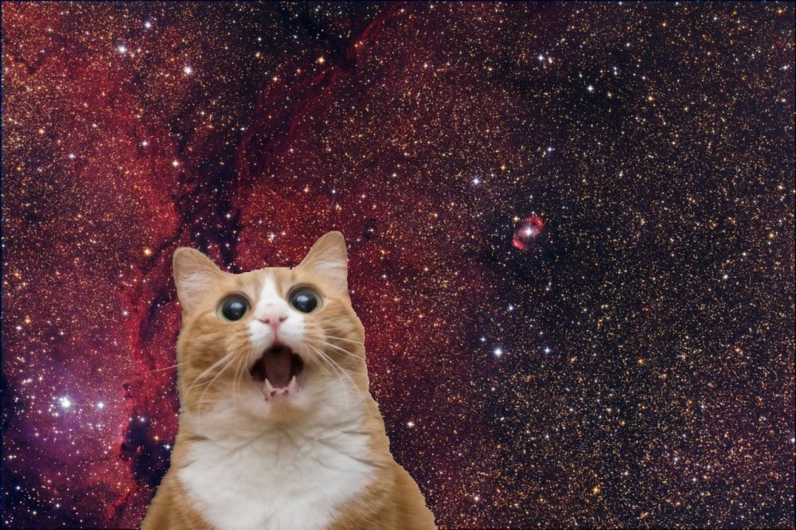

# Welcome to PetPaws!

If you love cats as much as I do, you'll love this site. You can both view
photos of kitties and upload a photo of your pet. You can put your like/dislike
reaction to each photo (yeah, I know, it's impossible to dislike a cat, but
still) and add the coolest ones to your Favourites.

## Voting

The first place you can start with is **Voting**. Each time, you will get a
random kitty that you can vote. If you click on like/dislike you will add the
cat to the matching section and get a new cat to vote. The favorite button (one
with the heart) will add the cat to your **Favourites**. You can remove the cat
from your **Favourites** if you want. Below the cat, you can track the history
of your voting activity for the current day.

### Likes / Dislikes

For your comfort, we collected kitties for which you voted in separate pages
that you can occasionally look at.

### Favourites

And you can manage your own **Favourites** - add and delete your cats (but why
would you delete them?) Also you can track your activity history with your
favorite cats here too.

## Breeds

When you visit the page, you will get all breeds of kitties. By default, the
breeds are sorted alphabetically from A to Z, but you can change sorting and
make it Z to A if you wish. You can also browse all breeds or find your
favorite. If you change the limit you can get 5, 10, 15 or 20 kitties. Each
kitty is clickable - you can get detailed information on each breed and more
photos of kitties of the selected breed.

## Gallery

Here you can just enjoy different pictures of kitties. It's also possible to
sort your requests by type of picture - animated or static. On top of that, you
can choose the number of pictures to load or choose a particular breed. When you
have chosen the criteria you want, feel free to click on the update button and
get a lot of emotions. You can add each kitty to your **Favorites** or remove it
from there. Just click on the heart.

> p.s. I suggest choosing to sort out animated and chose ascending order.
> Spoiler - it will be something cosmic :)

Also try to upload your cat to get it on our site too. Click the upload button
and follow the instructions. And maybe soon we'll all see them.

## Other Features

### Search

From anywhere on the site you can search for any breed - just type your request,
click enter or the search button, and we'll return everything we found. Be
careful - our search only accepts letters.

### Adaptive

For your comfort, we have made a version not only for your computer, but also
for your phone and tablet, so that you can use our site wherever you are.

### Light / Dark Mode

And because long sitting at the computer can tire your eyes (and you can only
look at cats for a long time), we have prepared a dark theme. It will save your
eyes, and you can enjoy the cats as long as you want, even at night.
